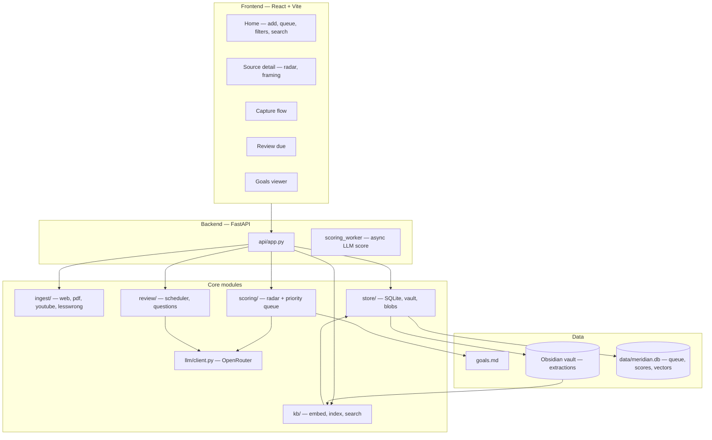
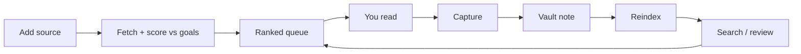

# Meridian

A goal-aware reading queue — not a summarizer.

Meridian scores sources against **your** quarterly goals, ranks a bounded queue,
forces capture after you read, and resurfaces what you kept via spaced review.
It replaces an unbounded pile of tabs with a deliberate learning loop.

## What problem it solves

Information arrives faster than you can consume it. You read at the wrong depth,
and a week later you have recognition instead of knowledge. Meridian targets both:

- **Overload** — a bounded, ranked queue aligned to `goals.md`
- **Shallow retention** — capture → Obsidian extraction notes → spaced quiz

---

## Quick start

### Prerequisites

- **Python 3.14** (Poetry-managed; do not use a global pip venv)
- **Node.js 18+** (frontend)
- **OpenRouter API key** (for scoring, capture drafting, and review questions)

### Setup

```bash
git clone <repo-url> && cd meridian
cp .env.example .env
# Edit .env — at minimum set MERIDIAN_OPENROUTER_API_KEY

poetry install
cd frontend && npm install && cd ..
```

### Run (development)

One command (starts API + frontend in a tmux session, or background fallback):

```bash
./start-meridian.sh
```

Then open **http://localhost:5173**

Manual setup (two terminals):

Terminal 1 — API on port 8000:

```bash
poetry run python -m meridian.main
```

Terminal 2 — UI on port 5173 (proxies `/api` → backend):

```bash
cd frontend && npm run dev
```

### First-time embedding model

The first search or reindex downloads `all-MiniLM-L6-v2` (~90MB) from HuggingFace
into `~/.cache/huggingface/`. After that, embeddings run **fully locally** — your
query text is never sent to HuggingFace during search.

---

## Using Meridian

This is the intended loop:

1. **Edit `goals.md`** — your quarterly mission, themes, and objectives. This is
   the highest-leverage file; scoring reads it on every add.
2. **Add a source** on Home — paste a web URL, direct PDF link, local PDF path,
   arXiv abstract URL, or YouTube link.
3. **Wait for scoring** — Meridian fetches text, calls the LLM for radar scores
   + framing, then places the source in your queue.
4. **Work the queue** — top ~10 items are “active”; the rest is backlog. Open a
   source, read/watch it yourself (Meridian does not summarize for you).
5. **Capture** — after reading, write what you took. Blank capture → shallow /
   revisit. Good capture → LLM-drafted extraction note preview → approve to vault.
6. **Review** — spaced questions generated from your own notes.
7. **Reindex** (when you want search) — `POST /reindex` or trigger from the UI
   builds local vector embeddings over queue source text.

**Supported inputs**

| Input | Example |
|-------|---------|
| Web article | `https://example.com/post` |
| Online PDF | `https://…/paper.pdf` (direct `.pdf` URL) |
| Local PDF | `/Users/you/Downloads/paper.pdf` |
| arXiv | `https://arxiv.org/abs/2301.12345` (abstract page; Meridian downloads the PDF) |
| YouTube | `https://youtube.com/watch?v=…` |
| LessWrong | `/posts/…` or legacy `/s/…/p/…` URLs |

Duplicates are rejected before fetch (HTTP 409) using a canonical key per platform.

---

## Architecture



### Storage layers

| Layer | Location | Role |
|-------|----------|------|
| **Goals** | `goals.md` (repo root) | Human-authored OKR doc; source of truth for scoring |
| **Extractions** | Obsidian vault (`MERIDIAN_CAPTURE_PATH`) | Permanent capture notes; compounding knowledge |
| **Operational** | `data/meridian.db` | Queue, scores, review schedule, embedding index — rebuildable except reviews/overrides |
| **Binaries** | `data/documents/` | Optional PDF blobs (gitignored) |

### Key backend modules

```
src/meridian/
  ingest/       Normalize URLs/paths; fetch text (web, PDF, YouTube, LessWrong)
  scoring/      LLM radar scores + priority queue ranking
  store/        SQLite schema, repository, vault I/O
  kb/           Chunk → embed → sqlite-vec; unified search
  review/       Spaced repetition scheduler + question generation
  llm/          Thin OpenRouter client (all chat calls)
  api/          FastAPI routes + background scoring worker
frontend/       React UI (Home, Source, Capture, Review, Goals, Knowledge)
```

### The learning loop



---

## Configuration

Copy `.env.example` → `.env`. All settings use the `MERIDIAN_` prefix.

| Variable | Default | Purpose |
|----------|---------|---------|
| `MERIDIAN_OPENROUTER_API_KEY` | *(required)* | LLM API key for scoring, capture, review |
| `MERIDIAN_LLM_MODEL` | `google/gemini-2.0-flash-001` | OpenRouter model id |
| `MERIDIAN_EMBED_MODEL` | `sentence-transformers/all-MiniLM-L6-v2` | Local embedding model (`stub` for tests) |
| `MERIDIAN_DATA_DIR` | `data` | SQLite + documents directory |
| `MERIDIAN_VAULT_PATH` | `~/Documents/Obsidian Vault/00-inbox` | Legacy inbox path |
| `MERIDIAN_CAPTURE_PATH` | `~/…/research/learnings/meridian` | Permanent extraction destination |
| `MERIDIAN_SEARCH_CAPTURES_ENABLED` | `false` | Enable vault RAG panel in search (LLM call) |

Restart the API after changing `.env`.

---

## Development

```bash
# Backend tests (71 tests)
poetry run pytest -q

# Frontend typecheck + production build
cd frontend && npm run build
```

**Conventions**

- Python managed with **Poetry only** (`poetry run …`, not global pip)
- All LLM calls go through `src/meridian/llm/client.py`
- Embeddings are always local — never via OpenRouter
- Markdown (goals + extractions) is source of truth; SQLite is derived

---

## Project layout

```
meridian/
  README.md                 This file
  goals.md                  Living OKR goals (edit often)
  goals-rationale.md        Why the current goals are shaped this way
  .env.example              Environment template
  src/meridian/             Python application
  frontend/                 React + Vite UI
  tests/                    Pytest suite
  docs/
    2026-08-19-vision.md    Why Meridian exists
    2026-08-19-spec.md      Functional behavior
    2026-08-19-architecture.md   Detailed technical design
    2026-08-19-plan.md      Build milestones (historical)
    prompts/                LLM system prompts used at runtime
  data/                     gitignored — meridian.db, documents/
```

---

## Documentation

- [Vision](docs/2026-08-19-vision.md) — the thesis
- [Spec](docs/2026-08-19-spec.md) — precise behavior
- [Architecture](docs/2026-08-19-architecture.md) — module boundaries, schema, flows

---

## Status

**MVP is running** — ingest, scoring, bounded queue, capture, review, local semantic
search, dedupe, and queue filters are implemented. Deferred: guided in-source
reading, allocation dashboard, podcast transcription, multi-user auth.

---

## License

Private experiment — see repository owner for usage terms.
