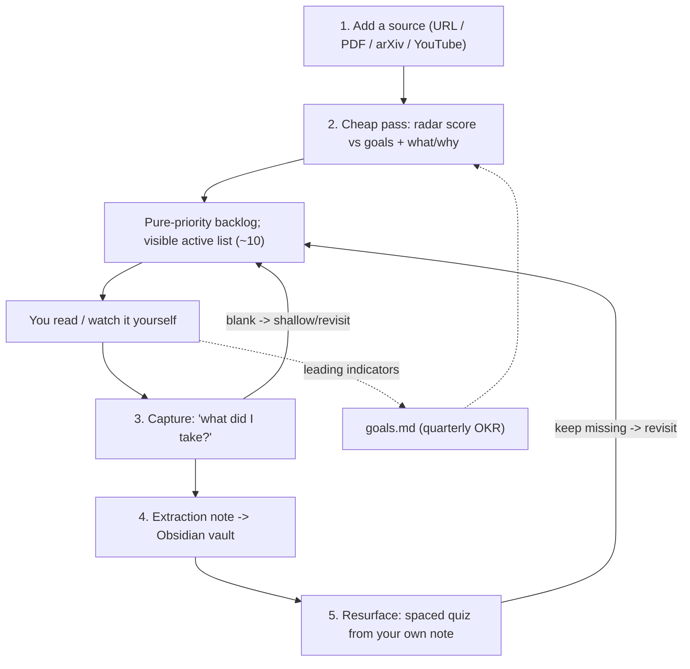

# Meridian

A learning director, not a summarizer.

Meridian tells you what's worth your attention (scored against your own goals),
then makes sure you actually keep what you learned. It replaces the unbounded
pile of open tabs with a bounded, goal-aware queue, a forced capture after every
source, and spaced review that quizzes you from your own notes.

## The problem it solves

Information piles up faster than you consume it, you read things at the wrong
depth out of habit, and a week later you have recognition instead of knowledge.
Meridian attacks both: the **overload** (a bounded queue, ranked by fit to your
goals) and the **shallow retention** (capture + spaced retrieval).

## The loop



## Design commitments

- **Objective-first.** Every source is scored against your goals before it earns
  a slot. Depth follows the objective, never habit.
- **Bounded visible queue.** The active list holds ~10 items; the backlog stays
  out of sight. An unbounded visible queue just recreates the open-tabs problem.
- **Extractions are the asset.** Sources are re-fetchable and disposable;
  what you took from them is not. Captures are the compounding knowledge base.
- **Layered storage.** Irreplaceable, human-authored data (goals, extractions)
  lives as plain markdown in your Obsidian vault. Operational state (queue,
  scores, review schedule, search index) lives in SQLite and is always
  rebuildable from the markdown.

## Stack

- Backend: FastAPI (Python 3.14, Poetry)
- LLM: a thin, swappable client defaulting to OpenRouter (Kimi / DeepSeek /
  Gemini Flash / Claude / etc.) for scoring, framing, capture, and questions
- Search: SQLite + a small local embedding model (`sqlite-vec`), embeddings free
- Frontend: minimal React (add box, active list, source detail with radar,
  capture form, reviews-due view)

## Repository layout

```
meridian/
  README.md                 you are here
  goals.md                  living OKR goals doc (the highest-leverage file)
  docs/
    2026-08-19-vision.md    why Meridian exists (the thesis)
    2026-08-19-spec.md      what it does (functional spec)
    2026-08-19-architecture.md   how it is built (technical design)
    2026-08-19-plan.md      build order (bite-sized TDD tasks)
    prompts/                runtime LLM system prompts
  src/meridian/             application code
  tests/                    tests
```

## Status

MVP in design. Guided in-source reading, the allocation dashboard, queue
lane-mixing, podcast transcription, and multi-user support are explicitly
deferred (see the spec's "Deferred scope").

## Documentation

- Start with the [vision](docs/2026-08-19-vision.md) for the "why".
- Read the [spec](docs/2026-08-19-spec.md) for precise behavior.
- Read the [architecture](docs/2026-08-19-architecture.md) for the technical design.
- Follow the [plan](docs/2026-08-19-plan.md) to build it.
