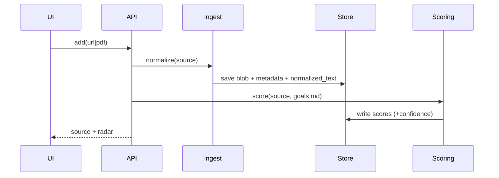
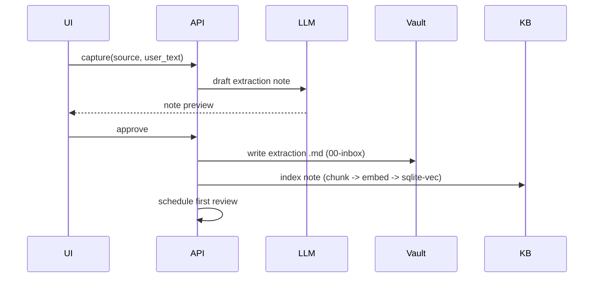

# Meridian — Architecture

*Created 2026-08-19. This is the "how": module boundaries, data stores, schema,
and the key flows. See the [spec](2026-08-19-spec.md) for behavior.*

## Principles

- **Layered storage.** Markdown is the source of truth for knowledge; SQLite is a
  derived, rebuildable operational layer; binaries are disposable files.
- **Thin interfaces.** Five components (ingest, scoring, store, kb, review) behind
  small, well-typed function boundaries. Files split by responsibility.
- **Swappable LLM.** All chat calls go through one client; the provider defaults
  to OpenRouter (Kimi / DeepSeek / Gemini Flash / Claude / etc.) and is a config
  value, so tasks can even be routed to different models. Embeddings run locally
  (OpenRouter is chat-only), keeping them free and private.
- **Lean.** No feature exists before its component earns it; deferred scope is not
  scaffolded.

## Module layout

```
src/meridian/
  ingest/
    web.py           # Engine A: URL -> readable text
    pdf.py           # Engine B: PDF / arXiv -> text
    transcript.py    # Engine C: YouTube captions -> text
    normalize.py     # metadata + genre classification, dispatch
  scoring/
    radar.py         # LLM structured-output call -> 5 axes + breakdown
    priority.py      # priority formula + urgency decay
  store/
    db.py            # SQLite connection, schema, migrations
    vault.py         # read/write markdown extraction notes + goals.md
    blobs.py         # data/documents/ binary storage
    models.py        # dataclasses / pydantic types shared across modules
  kb/
    index.py         # scan vault -> chunk -> embed -> sqlite-vec
    query.py         # flagship "what do I believe about X" RAG
  review/
    scheduler.py     # spaced-repetition intervals + due selection
    questions.py     # generate a question from a capture
  llm/
    client.py        # provider-agnostic chat + embeddings client
    prompts.py       # load prompt templates from docs/prompts/
  api/
    app.py           # FastAPI app + routes
    schemas.py       # request/response models
frontend/            # React app (5 screens)
data/                # gitignored: meridian.db, documents/
```

## Data stores

- **Obsidian vault** (`~/Documents/Obsidian Vault/00-inbox/`, configurable):
  extraction notes as markdown. Source of truth for knowledge.
- **Repo root:** `goals.md` (living, markdown).
- **`data/documents/`** (gitignored): original binaries (PDF, downloaded audio).
- **`data/meridian.db`** (gitignored, SQLite): normalized text, scores, queue
  state, review schedule, embeddings index.

## SQLite schema

```sql
CREATE TABLE sources (
  id              INTEGER PRIMARY KEY,
  added_at        TEXT NOT NULL,
  url             TEXT,
  source_type     TEXT NOT NULL,      -- web | pdf | arxiv | youtube
  genre           TEXT,               -- paper | textbook | nonfiction | video
  title           TEXT,
  author          TEXT,
  length_meta     TEXT,               -- JSON: words / minutes / pages
  blob_path       TEXT,               -- data/documents/... (nullable)
  normalized_text TEXT,               -- extracted text (nullable until fetched)
  status          TEXT NOT NULL       -- queued | reading | captured | skipped | revisit
);

CREATE TABLE scores (
  source_id       INTEGER PRIMARY KEY REFERENCES sources(id),
  relevance       REAL, urgency0 REAL, effort REAL,
  depth_required  REAL, curiosity REAL,
  decay_lambda    REAL,
  theme_breakdown TEXT,               -- JSON: {theme: score}
  rationale       TEXT,
  confidence      TEXT,               -- low | medium | high
  scored_at       TEXT
);

CREATE TABLE queue_overrides (      -- manual triage reorders (signal)
  source_id       INTEGER PRIMARY KEY REFERENCES sources(id),
  manual_rank     REAL,
  note            TEXT
);

CREATE TABLE reviews (
  id              INTEGER PRIMARY KEY,
  note_path       TEXT NOT NULL,      -- vault extraction note
  source_id       INTEGER REFERENCES sources(id),
  question        TEXT NOT NULL,
  due_at          TEXT NOT NULL,
  interval_days   REAL NOT NULL,
  ease            REAL NOT NULL,
  history         TEXT                 -- JSON: [{date, grade}]
);

-- embeddings via sqlite-vec virtual table
CREATE VIRTUAL TABLE emb USING vec0(
  embedding float[384]                 -- small model dims (example)
);
CREATE TABLE emb_meta (
  rowid           INTEGER PRIMARY KEY, -- matches emb rowid
  note_path       TEXT,                -- source of truth pointer
  source_id       INTEGER,
  chunk_text      TEXT
);
```

The queue is a query, not a table: `status='queued'` sources ordered by
`priority` (from `scores`), with `queue_overrides` applied; the active list is the
top ~10.

## Key flows

### Ingest -> score


### Capture -> note -> index


### Flagship query
Embed question -> `sqlite-vec` search over `emb` -> gather `emb_meta` chunks +
source refs -> LLM synthesizes grounded answer with citations.

## LLM client

`llm/client.py` exposes `chat(messages, schema=None)` (structured output, via
OpenRouter) and `embed(texts)` (local embedding model). Provider + model + API
base are config. Prompts load from `docs/prompts/` via `llm/prompts.py`. There are
three templates, one per lifecycle stage: `ingest.md` (scoring + framing),
`capture.md` (dialogue -> note), `review.md` (capture -> question). The flagship
query uses a small inline synthesis prompt in `kb/query.py`.

## Configuration

A single `config` (env / `.env`): vault path, `data/` path, LLM provider + model
+ key, embedding model. Personal defaults now; the same keys make the
`personal -> product` transition (SQLite -> Postgres, per-user vault paths)
mechanical.

## Tech choices

- FastAPI + Uvicorn; Poetry; Python 3.14.
- Ingestion: readability/`trafilatura` (web), `pymupdf` (PDF),
  `youtube-transcript-api` (captions).
- LLM via OpenRouter (per-task model choice); `sqlite-vec` for vectors; a small
  local embedding model (`sentence-transformers`, ~384-dim) — free and private.
- React + Vite frontend calling the FastAPI JSON API.

## Rebuild + consistency

- The embeddings index and review questions derive from vault notes; a
  `reindex` routine rebuilds `emb`/`emb_meta` from scratch.
- Normalized text and scores derive from sources; re-ingest re-derives them.
- Only `reviews` scheduling state and `queue_overrides` are non-reconstructable,
  and both are non-catastrophic to lose.
