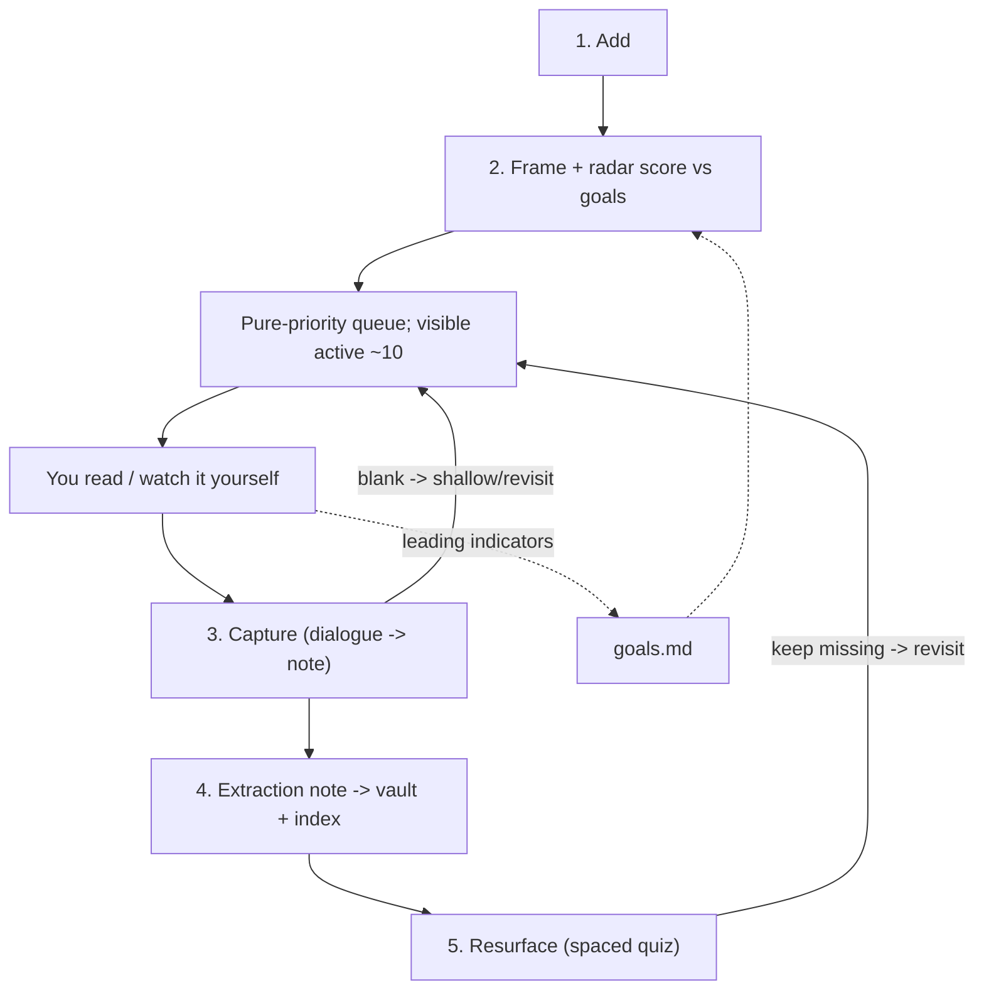

# Meridian — Functional Spec

*Created 2026-08-19. This is the "what": precise behavior of each component. See
the [vision](2026-08-19-vision.md) for the "why" and the
[architecture](2026-08-19-architecture.md) for the "how".*

## Purpose

A goal-aware reading queue that scores each source against a quarterly
OKR-structured goals doc, lets you consume it yourself, then forces a capture into
your Obsidian vault and resurfaces it via spaced review.

## Scope

**In (MVP):** ingestion (web, PDF/arXiv, YouTube captions), radar scoring +
pure-priority queue, bounded active list, capture-as-dialogue, extraction notes
to the vault, SQLite + embeddings knowledge base with the flagship query, spaced
review, and five UI screens (Home, Source detail, Capture, Review, Goals).

**Deferred:** guided in-source reading (depth ladder + inline reading pane),
queue lane-mixing / allocation dashboard, podcast audio transcription (Whisper),
EPUB parsing, multi-user / auth.

## The loop



## Components

### C1 — Ingestion + normalization
Single `add` entry point accepting: web URL, PDF (upload or arXiv link), YouTube
link. Three engines, all normalizing to text:
- **Engine A (web):** fetch readable article text from a URL.
- **Engine B (file):** extract text from a PDF / arXiv paper.
- **Engine C (transcript):** fetch YouTube captions. (Podcast Whisper fallback
  deferred.)

Behavior:
- Original binaries are saved to `data/documents/`; normalized text is stored in
  SQLite.
- Ingest captures metadata (title, author, type, length) and classifies genre
  (paper / textbook / nonfiction / video).
- Ingest then triggers C3 scoring. Metadata-only scoring is allowed; text firms
  up the score and confidence later.

### C2 — Goals model
`goals.md` at repo root (living, human-authored, quarterly cycle, weekly review).
Structure: Mission, Themes (radar axes), cycle Objectives (each with lagging Key
Results + tool-tracked leading indicators), `target_mix`, goal-less Curiosity
lane. Measurability rule: observable action verb + success criterion; banned
words (understand, know, learn about, grasp, appreciate). The agent reads it at
every scoring and triage step and may propose amendments; the human authors it.

### C3 — Scoring + prioritization
The agent scores five radar axes (0-10) via a single structured-output LLM call
at ingest (`docs/prompts/ingest.md`, which also returns the what/why framing)
taking `goals.md` + the source:
- **relevance** — LLM, per-theme vector against Themes + Objectives, aggregated.
- **curiosity** — LLM, intrinsic interest independent of goals.
- **depth-required** — LLM, from genre + objective.
- **effort** — deterministic from length metadata, LLM-refined (estimated hours).
- **urgency** — LLM tags a decay type; current value computed over time.

Each score carries a `rationale`, a `theme_breakdown`, and a `confidence`
(low for metadata-only on an obscure source). Priority:

```
priority = relevance * urgency / effort
urgency(t) = urgency_0 * exp(-lambda * age)   # lambda from decay type; evergreen ~ 0
```

Priority is recomputed as urgency decays. Ranking is proposed; a weekly manual
triage lets the user override, and overrides are treated as signal.

### C4 — Queue
- **Backlog:** every non-terminal source, ranked by priority. Hidden by default.
- **Active list:** the top ~10, surfaced. Summon the backlog explicitly.
- Pure priority for the MVP (lane-mixing to a target ratio is deferred).
- Item statuses: `queued`, `reading`, `captured`, `skipped`, `revisit`.

### C5 — Capture (anti-illusion)
When an item is popped and consumed, the user states what they took — typed or as
a short dialogue with the agent. The agent drafts a structured extraction note
(`docs/prompts/capture.md`); the user approves before it is written to the vault.
An empty reflection returns `SHALLOW`, which flags the item `revisit` and returns
it to the queue.

Extraction note (extends the existing `learning-capture` format), written to the
vault `00-inbox/`:

```markdown
---
type: extraction
date: YYYY-MM-DD
topic: math/linear-algebra
source: "https://… (Strang, Lecture 1)"
source_type: video
objective: "Refresh change-of-basis intuition for RL"
goals: [foundations/linear-algebra]
related: [[extraction-2026-08-10-eigendecomposition]]
---

# Short descriptive title

## Objective
One line, carried from framing.

## What I took
A few lines, my own words — the payload that gets kept and later quizzed.

## Connections
Links to related extractions.
```

### C6 — Knowledge base + RAG
The vault is the knowledge base; the index is derived:
- An indexer scans extraction notes, chunks `## What I took`, embeds with a small
  model, stores vectors in SQLite (`sqlite-vec`) with a back-pointer to the note
  file + `source`.
- **Flagship query** "what do I believe about X, and from which sources?": embed
  the question, vector-search extraction chunks, synthesize an answer grounded
  with citations to notes and their sources.
- The index is rebuildable from the vault at any time. Extractions are the
  primary retrieval target; normalized source text is indexed secondarily to
  support re-deepening.

### C7 — Resurface (spaced review)
- Generate one question per note from `## What I took` + objective
  (`docs/prompts/review.md`).
- Show the question first; reveal the capture after; self-grade
  `got it / partial / missed`.
- Expanding intervals (Anki-style); repeated misses flag the source `revisit`.
- Schedule state (due, interval, ease, history) lives in SQLite only.

## Frontend (5 screens)

1. **Home / Queue** — global add bar; active list (~10) with per-item radar
   glyph, priority, theme tags; hidden "show backlog".
2. **Source detail** — metadata + full radar + agent what/why framing + reading
   plan (for big sources); `Start` / `Capture` actions.
3. **Capture** — objective shown; dialogue box; agent-drafted note preview;
   `Save to vault` or `Nothing stuck -> revisit`.
4. **Review** — "N due"; question -> reveal -> self-grade.
5. **Goals** — renders `goals.md` with leading-indicator progress per objective
   (hours/theme this week, captures, review pass-rate). Lightweight; the full
   allocation dashboard is deferred.

## Storage summary

- Knowledge (extraction notes, `goals.md`) -> markdown (vault + repo root).
- Original binaries -> `data/documents/` (gitignored, re-fetchable).
- Normalized text, scores, queue, review schedule, embeddings -> SQLite
  (`data/meridian.db`, gitignored).
- Invariant: deleting the DB loses only queue order, review timing, and a
  rebuildable index — never a goal or an extraction.

## Non-goals
Meridian is not a summarizer, a read-it-later app, or a bookmark manager. It does
not (in the MVP) guide you inside a source, transcribe caption-less audio, parse
EPUBs, or support multiple users.
